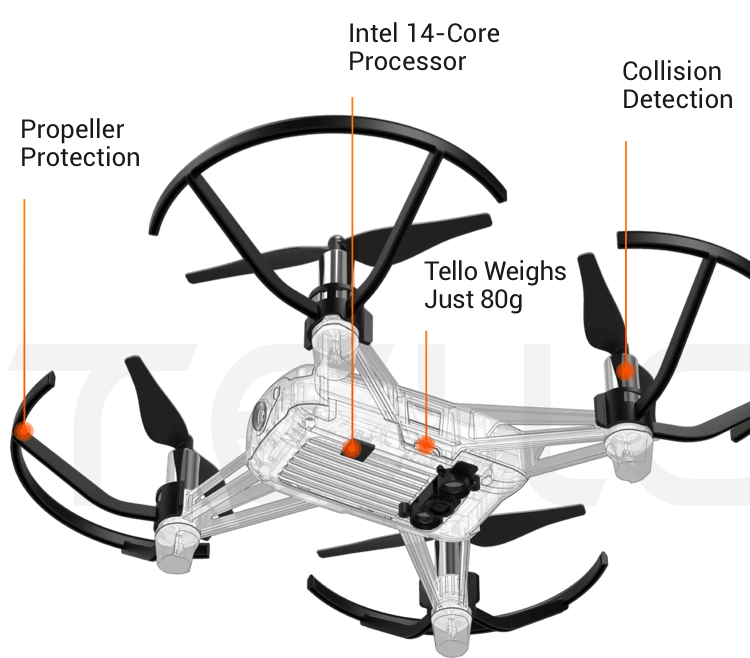
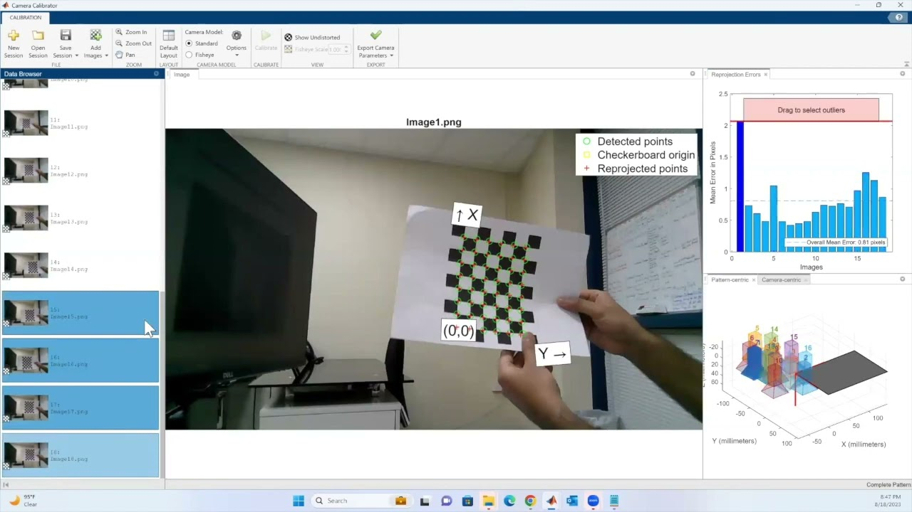

# Tello Edu Control Software on Simulink

## Table of Contents

1. [Setup the Project](#setup-the-project)
2. [Materials Used](#materials-used)
3. [Modified Tello Matlab Library](#modified-tello-matlab-library)
4. [Tello Drone Control on Simulink](#tello-drone-control-on-simulink)
5. [SLAM (Simultaneous Localization and Mapping) on Simulink with Tello](#slam-on-simulink-with-tello)
6. [Optitrack Setup](#optitrack-setup)
7. [Drone Positioning with YOLO and Semantic Mapping with YOLO](#drone-positioning-with-yolo-and-Semantic-Mapping-with-YOLO)
8. [Camera Calibration with Matlab](#camera-calibration-with-matlab)
9. [Aruco Positioning with Tello's Down Camera](#aruco-positioning-with-tellos-down-camera)
10. [Waypoint Manager and Control of Tello](#waypoint-manager-and-control-of-tello)
11. [Bibliography](#bibliography)

## Setup the Project

1. Clone the Github repository : git clone [repository_url]
2. Go inside the directory
3. Install the dependencies with the command `git submodule update --init`
   This will install the Optilink module, used to link Optitrack to the Simulink model.
4. Setup the Optilink tool (Cf. Readme/Setup on https://github.com/DroneSEN/Optilink)

## Materials Used

- Tello EDU Drones: Used for implementing control algorithms and SLAM.



- Simulink: A simulation and model-based design environment for dynamic and embedded systems.
- Optitrack System: Used for precise tracking of the drone.
- YOLO (You Only Look Once): A real-time object detection system.
- Matlab: For camera calibration, SLAM, and various computational tasks.
- Aruco Markers: Used for positioning with the Tello's down-facing camera.

## Modified Tello Matlab Library

The Ryze Tello [Matlab library](https://fr.mathworks.com/help/matlab/ryzeio.html) has been modified to enhance its functionality for this project. These modifications include:

1. Improved navigation commands with RC commands.
2. Added the ability to switch to and access the down-facing camera stream.
3. Enhanced real-time streaming, ensuring the stream does not freeze during yaw, takeoff, or land commands.

## Tello Drone Control on Simulink

The project involves controlling the Tello EDU drones using Simulink. This section details the integration of Tello drone control within Simulink, including setting up communication between the drone and Simulink, and implementing flight control algorithms with the used of the matlab library of Ryze Tello.

## SLAM (Simultaneous Localization and Mapping) on Simulink with Tello

SLAM is a critical component of autonomous navigation. This section covers the implementation of SLAM using Simulink and Tello drones. The process involves:

1. Real-time mapping of the environment.
2. Localization of the drone to get the pose (tform) of the drone in Slam referential.

## Optitrack setup

Optitrack is used for tracking the precise position of the drone. 

## Drone Positioning with YOLO and Semantic Mapping with YOLO

YOLO is used for object detection ([Matlab YOLOv4](https://fr.mathworks.com/help/vision/ug/object-detection-using-yolov4-deep-learning.html)) to position the drone and perform semantic mapping. This section includes:

1. Setting up YOLO for real-time detection.
2. Calculating the pose of the drone or objects within a partially known environment.
3. Semantic mapping

More information available on this system in the [this document](docs/ObjectDetection.md).

## Camera Calibration with Matlab

Accurate ([camera calibration](https://fr.mathworks.com/help/vision/camera-calibration.html)) is essential to have the intrinsincs matriw of each drones.

The intrinsic matrix `K` of the camera is given by:

$$
K = 
\begin{pmatrix}
f_x & 0 & c_x\\
0 & f_y & c_y\\
0 & 0   & 1
\end{pmatrix}
$$


Where:
- $f_x$ and $f_y$ are the focal lengths in the x and y directions, respectively.
- $c_x$ and $c_y$ are the coordinates of the principal point (usually at the center of the image).


### Step-by-Step Process

1. **Capture Calibration Images:**

   Use the provided Matlab script to capture images of a checkerboard pattern. Ensure that the checkerboard is visible in different positions and angles to cover the entire field of view of the camera.

   ```matlab
   % Run the script to capture images
   run('/DRONE_edutello/Simulink_Tello_drone-main/camera_calibration/camera_calibration_photo_extract.m')


2. **Open the Camera Calibrator App:**

   In Matlab, open the Camera Calibrator app using the following command:

   `run cameraCalibrator`

   

3. **Import Calibration Images:**

   Click on Add Images and select the images captured in step 1.
   Ensure that the images contain a clear view of the checkerboard pattern.

4. **Set Checkerboard Parameters:**

   Enter the square size and the number of squares in the checkerboard.
   For this example, use the following settings:

   - Square Size: 34 (in millimeters)
   - Number of Squares: 6 rows by 8 columns

5. **Perform Calibration:**

   Click on Calibrate to start the calibration process.
   Matlab will process the images and compute the camera parameters.

6. **Review Calibration Results:**

   After the calibration is complete, review the reprojection errors and ensure they are within an acceptable range.
   Save the calibration session and export the camera parameters for future use.

## Aruco Positioning with Tello's Down Camera

Aruco markers are used for precise positioning during takeoff. 

## Waypoint Manager and Control of Tello

The waypoint manager is responsible for planning and executing flight paths. 

## Bibliography

Carlos Campos et al., *ORB-SLAM3: An Accurate Open-Source Library for Visual, Visual-Inertial and Multi-Map SLAM* [Link](https://arxiv.org/pdf/2007.11898)

Peter Corke, *Robotics, Vision and Control (Third Edition), Fundamental Algorithms in Python* [Link](https://link.springer.com/book/10.1007/978-3-031-06469-2)

Peter Corke, *Robotics, Vision and Control (Second Edition), Fundamental Algorithms in Matlab* [Link](https://link.springer.com/book/10.1007/978-3-319-54413-7)

S. Garrido-Jurado et Al, *Automatic generation and detection of highly reliable fiducial markers under occlusion*, Jan. 2014 [Link to ResearchGate](https://www.researchgate.net/publication/260251570_Automatic_generation_and_detection_of_highly_reliable_fiducial_markers_under_occlusion)

Steven M. LaValle, *Planning Algorithms* [Link](https://lavalle.pl/planning/)
