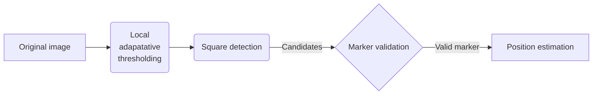
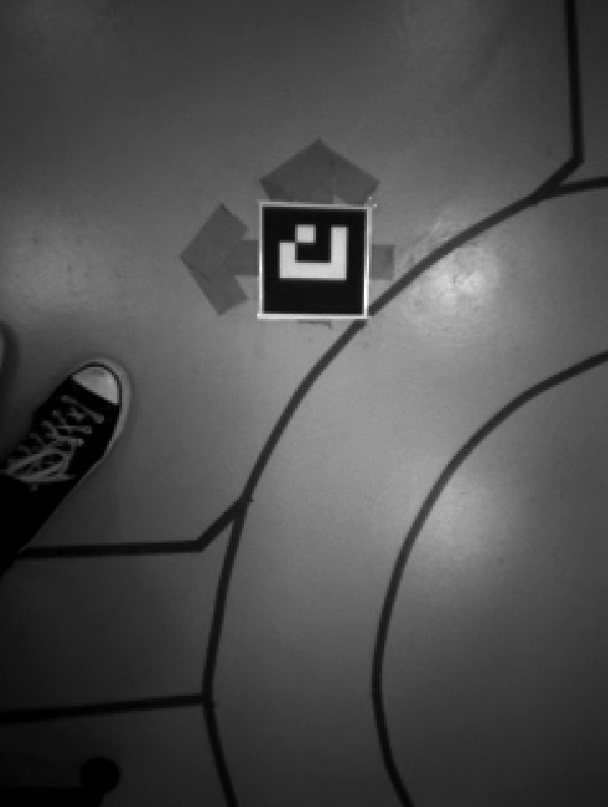
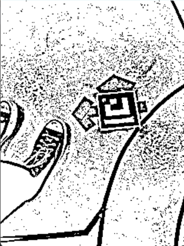
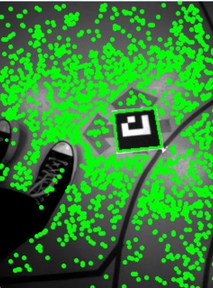
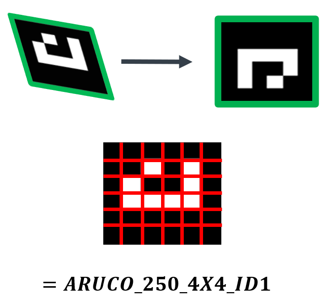
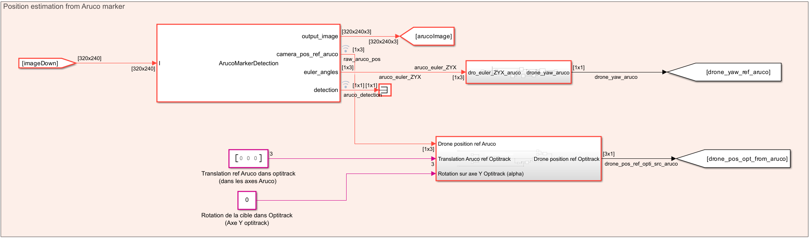
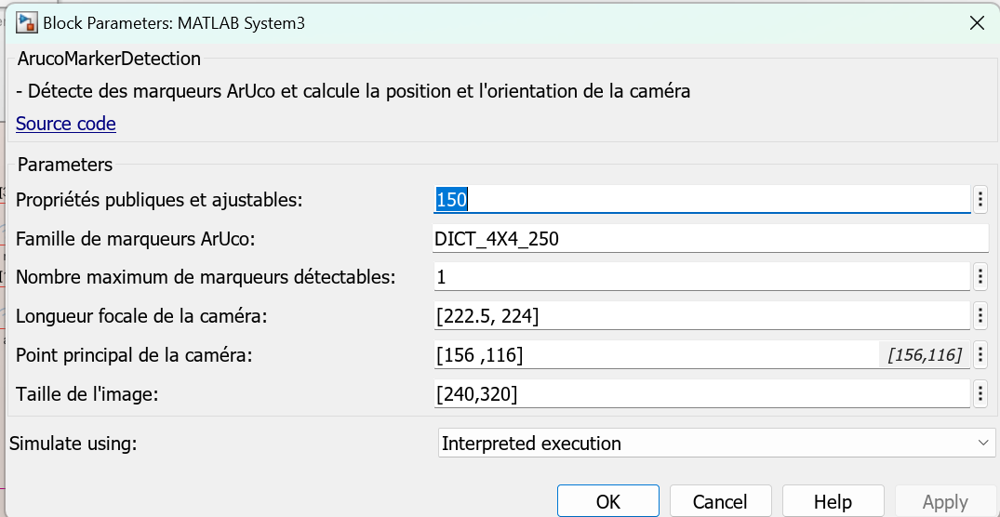
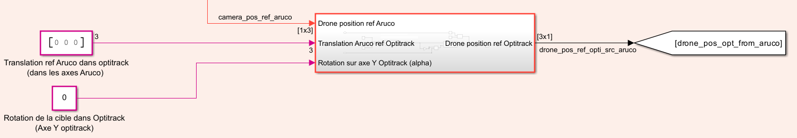

# Use of Aruco marker for initial position estimation

The SLAM system is a powerful tool for estimating the position of a UAV in flight (Cf. [SLAM explanation](SLAM.md)).

However, we encountered some limitations, one of which is particularly problematic: sudden changes in speed can cause the SLAM system to lose tracking and therefore lose the position. This issue is especially prevalent during takeoff, making it difficult for the drone to determine its initial position once airborne.

To address this problem, we used the downward-facing camera and easily recognizable targets (Aruco markers) to accurately estimate the drone's position after takeoff.

## Theory

To estimate the drone's position relative to the Aruco marker, a series of computer vision computations must be performed.

1. **Capture Image and grayscale conversion**
   
   Use the downward-facing camera to capture an image of the area below the drone and convert it in grayscale (if not already).

   <figure>
       
       <figcaption>Original image in grayscale acquired by the downward-facing camera</figcaption>
   </figure>

   
2. **Contour detection : local adaptative thresholding**
   
   Using a local adaptative thresholding algorithm, the image is converted into a black and white matrix, making it easier to detect edges.

   <figure>
       
       <figcaption>Example of Local Adaptative Thresholding</figcaption>
   </figure>

3. **Square detection**
   
   Identify and isolate square shapes in the thresholded image, which are potential candidates for Aruco markers. This involves detecting contours and approximating them to polygons, then filtering out non-square shapes.

   <figure>
       
       <figcaption>Example of Square detection, overlapped with the grayscaled image</figcaption>
   </figure>
   
4. **Decode Aruco target**
   
   Once the list of square candidates is built, each candidate goes through the following steps:
   1. The perspective is corrected to form a perfect square.
   2. Knowing the type of Aruco marker being searched for, the pixels are decoded into ones and zeros to identify the Aruco marker and compare it to the expected code.
   3. If the pattern matches the Aruco pattern, the algorithm proceeds to the next step; otherwise, the next square candidate is processed.

   <figure>
      
      <figcaption>Perspective correction and target decoding</figcaption>
   </figure>

5. **Calculate Position**
   
   Once the target has been identified in the image, the position and orientation of the image relative to the camera is computed using the [Pinhole camera model](https://en.wikipedia.org/wiki/Pinhole_camera).

## Managing Aruco target on simulink

**Projet files**
- `Matlab_System\ArucoMarkerDetection.m` : Contains the Aruco marker logic
- `Simulink_Part\ArucoPositionEstimation.slx` : User interface to control the drone using the position data computed via Aruco target

### Process

The detection and position steps are made by the matlab function `readArucoMarker` from the Computer Vision Toolbox.

### Input

You need to enter the intrinsic parameters of the camera and the size of the image (currently hard-coded in the program):​
$$
K = 
\begin{pmatrix}
f_x & 0 & c_x\\
0 & f_y & c_y\\
0 & 0   & 1
\end{pmatrix}
$$

Additionally, provide the following parameters for the Aruco marker detection system:

- `markerSizeInMM`: Specifies the size of the Aruco markers in millimeters.

    **Impact of Adjustment:**

    - **Increase**: Suitable for larger markers, ensuring accurate detection and pose estimation. However, might be less effective for smaller markers.
    - **Decrease**: Suitable for smaller markers, but may result in reduced accuracy if the marker size does not match the actual size.

- `maxMarkers`: Determines the maximum number of detectable markers.

    **Impact of Adjustment:**

    - **Increase**: Allows detection of more markers, which is useful for environments with multiple markers. However, it increases computational load.
    - **Decrease**: Reduces computational load and is suitable for scenarios with fewer markers, but limits the number of detectable markers.

- `imageSize`: Specifies the size of the image captured by the camera.

    **Impact of Adjustment:**

    - **Correct Image Size**: Ensures proper scaling and alignment of the captured image for marker detection.
    - **Incorrect Image Size**: Leads to scaling issues and potential misalignment in marker detection.

### Output

The Aruco marker detection system provides the following outputs:

- **Output Image**: The processed image with detected markers and axes drawn for visualization.
- **Camera Position Relative to Aruco Markers**: The position of the camera in relation to the detected Aruco markers, represented as a 3D coordinate.
- **Euler Angles**: The orientation of the camera relative to the detected Aruco markers, represented as Euler angles.
- **Detection Flag**: Indicates the detection status of the Aruco markers. 
  
  Possible values:
  - 0: No markers detected.
  - 1: Markers detected successfully.

### Post-process

Once the position of the drone in the Aruco target referential is computed, it is transformed via a transformation matrix to obtain the position of the drone in the global renferential (Optitrack).

This system takes as input the position and rotation of the Aruco target in the global referential and outputs the drone position in the Optitrack referential.

## References

- S. Garrido-Jurado et Al, *Automatic generation and detection of highly reliable fiducial markers under occlusion*, Jan. 2014 [Link to article](https://www.researchgate.net/publication/260251570_Automatic_generation_and_detection_of_highly_reliable_fiducial_markers_under_occlusion)
