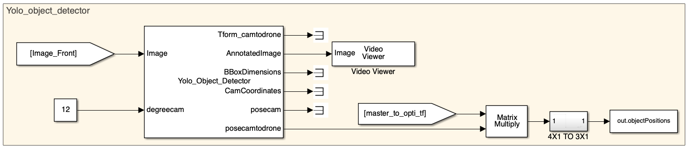
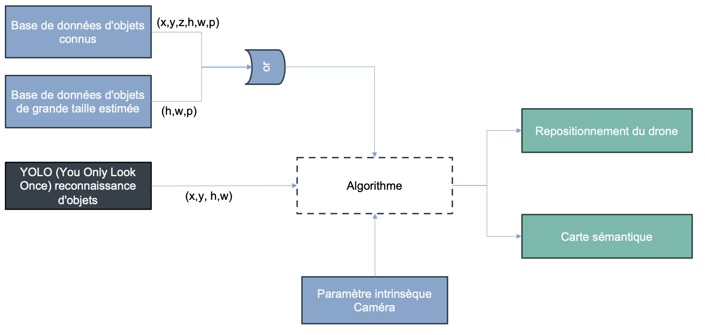
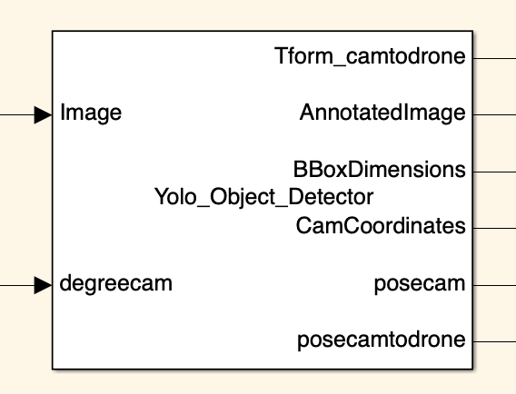
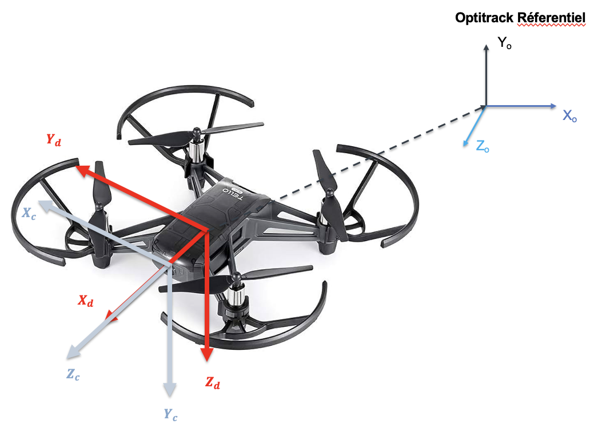
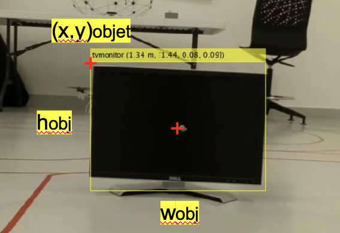
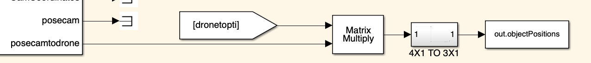
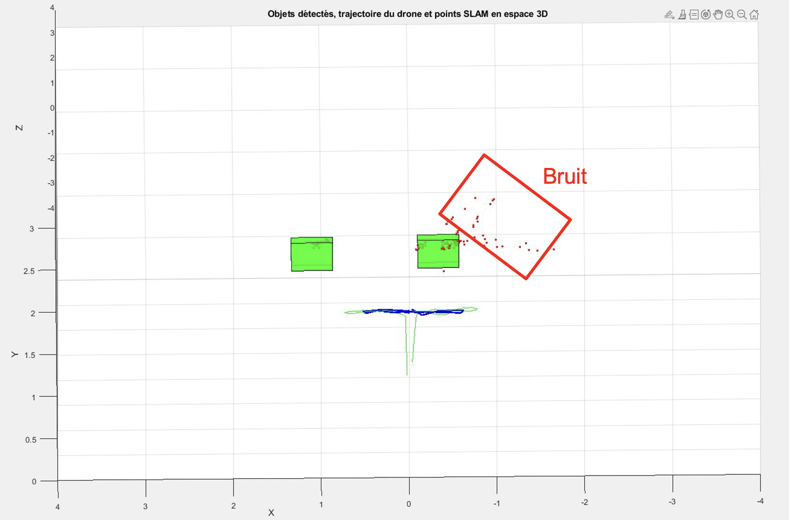

# Object Detection

This document is dedicated to the YOLO Object Detection system.

## Overview

This project utilizes the YOLO object detection algorithm to calculate the position of objects in the Optitrack referential and map them into a semantic map using MATLAB.

### YOLO Block



1. **Overview of the Process and Goals:**

    

    Our system calculates the position of objects in the Optitrack referential and maps them into a semantic map using the MATLAB code below and a To Workspace block as output:
    
    ```matlab
    Simulink_Tello_drone-main/Matlab_function/Carte_semantique.m
    ```

2. **Detailed View of the MATLAB System Block for YOLO:**

    

    **Inputs:**

    - **Image**: The input image on which object detection and further processing are performed. You need to define the camera resolution in the MATLAB system code here:
    
    ```matlab
    Simulink_Tello_drone-main/Matlab_System/Yolo_Object_Detector.m
    ```
    - **degreecam**: The angle of the camera in degrees, used for calculating the camera pose and transformation matrices. The drone's camera has a small orientation of around 10 degrees to the ground.

    **Outputs:**

    - **Tform_camtodrone**: This output provides the transformation matrix that converts coordinates from the front camera frame to the drone frame. The image below shows the camera referential in grey, the UAV referential in red, and the transformation into the Optitrack referential, which is done after the YOLO block.
    
    

    - **AnnotatedImage**: This output is the input image with bounding boxes and annotations drawn on detected objects. Example:
    
    

    - **BBoxDimensions**: This output provides the dimensions of the bounding boxes around detected objects.
    - **CamCoordinates**: This output provides the coordinates of detected objects in the camera frame.
    - **posecam**: This output gives the pose of the object in the camera referential as a 4x1 matrix.

    $$
    posecam = 
    \begin{pmatrix}
    X\\
    Y\\
    Z\\
    1
    \end{pmatrix}
    $$

    - **posecamtodrone**: This output gives the pose of the object in the UAV referential as a 4x1 matrix.

    $$
    posecamtodrone = 
    \begin{pmatrix}
    X\\
    Y\\
    Z\\
    1
    \end{pmatrix}
    $$

3. **Transformation to Optitrack Referential:**

    

    We multiply the position of the detected object in the UAV referential (4x1) with the TFORM UAV to Optitrack.

4. **Semantic Map:**

    Our code "semantic_map" retrieves various variables from Simulink using different "To Workspace" blocks:

    - Camera movement (Optitrack): green line
    - Camera movement (SLAM): blue line
    - XYZ points (SLAM): blue points
    - Object position estimation with the camera: red points
    
    Finally, we configure the true position of two objects in space directly in the code.

    To visualize this, we use `plot3` and `scatter` functions in MATLAB.

    