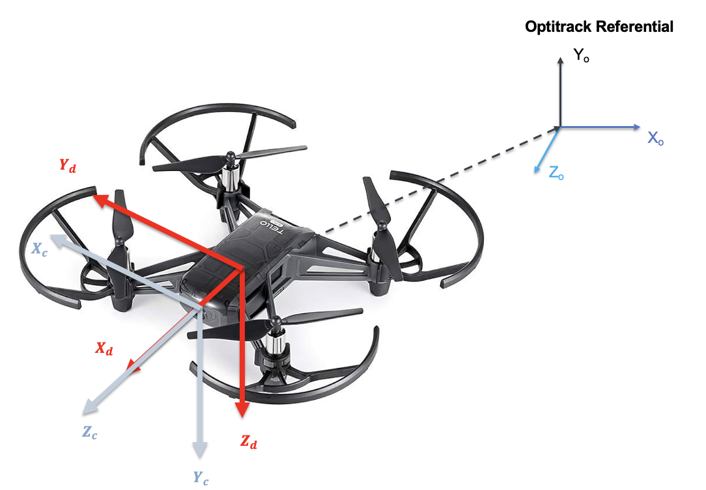

# Object detection

This document is dedicated to the Yolo Object Detection system.

**The block Yolo :**


1. **There you have an overview of the process and the goal of our applicaiton with Yolo :** 

    

    Actually our system is made to calculate the position object in the Optitrack referential and map it into a semantic map with the matlab code below and toworkspace block in output : 

    ```matlab
        Simulink_Tello_drone-main/Matlab_function/Carte_semantique.m
    ```

2. **Focus on our block matlab system for yolo :**

    

    **Inputs**

    - Image: The input image on which object detection and further processing will be performed. You have to defined the resolution of the camera into the matlab system code there : 

    ```matlab
    Simulink_Tello_drone-main/Matlab_System/Yolo_Object_Detector.m
    ```
    - degreecam: The angle of the camera in degrees, which is used for calculating the camera pose and transformation matrices, in fact the camera of the drone as a small orientation around 10 degree to the ground.

    **Outputs**

    - Tform_camtodrone: This output provides the transformation matrix that converts coordinates from the Front camera frame to the drone frame.There you can have in grey the camera referential in red the UAV referential and the transformation into optitrack referential wich is done after the yolo Block. 

    

    - AnnotatedImage: This output is the input image with bounding boxes and annotations drawn on detected objects. Like this one : 

    

    - BBoxDimensions: This output provides the dimensions of the bounding boxes around detected objects.
    - CamCoordinates: This output provides the coordinates of detected objects in the camera frame.
    - posecam: This output gives the pose of the object in the camera referential, wich is a matrix 4X1.

    $$
    posecam = 
    \begin{pmatrix}
    X\\
    Y\\
    Z\\
    1
    \end{pmatrix}
    $$

    - posecamtodrone: This output gives the pose of the object in the UAV referential, wich is a matrix 4X1.

    $$
    posecamtodrone = 
    \begin{pmatrix}
    X\\
    Y\\
    Z\\
    1
    \end{pmatrix}
    $$

3. **Transformation to optitrack referential :**

    

    What we are doing there is that we multiply our position of the detected object in the UAV referential (4X1) with the TFORM UAV to optitrack.

4. **Semantic map** 

    Our code "semantic_map" retrieves various variables from Simulink using different "to workspace" blocks:

    - Camera movement (Optitrack) : green line
    - Camera movement (SLAM) : blue line
    - XYZ points (SLAM) : blue point
    - Object position estimation with the camera : red point
    
    Finally, the true position of two objects in space, which we configure directly in the code.

    To do this, we use plot3 and scatter. 

    