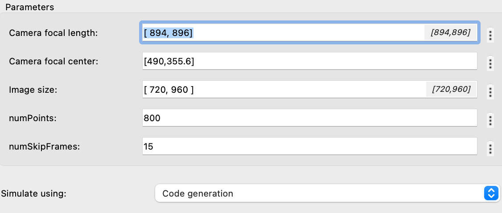

# SLAM (Simultaneous Localization and Mapping) on Simulink with Tello

MonoVSLAM in MATLAB is a powerful tool for creating 3D maps and tracking camera position using video or image streams. Ideal for real-time applications like autonomous navigation and augmented reality, it leverages advanced computer vision algorithms and integrates seamlessly with MATLAB for efficient analysis and prototyping.

### How managed monovslam ? 

1. **Process:**
    To develop it in real-time in Simulink, we are using a MATLAB system. You can find it at this path:

    ```matlab
    Simulink_Tello_drone-main/Matlab_System/MonoVisualSLAMSystem.m
    ```

    ```mermaid
    flowchart LR
        A[Sensors] --> B[ORB Based Keypoint Detection and Matching]
        B --> C[Pose Estimation: Fundamental Matrix Triangulation Bundle Adjustment]
        C --> D[Path Estimation]
        D --> E[Loop Closure + Visual Odometry]
        C --> F[Camera Position + Local Map]

2. **Input:**

    

    There you have to enter the intrinsic parameters of the camera and the size of the image:

    $$
    K = 
    \begin{pmatrix}
    f_x & 0 & c_x\\
    0 & f_y & c_y\\
    0 & 0   & 1
    \end{pmatrix}
    $$

    Secondly, you have to enter the parameters of the SLAM:

    `numPoints`: Specifies the number of feature points used for tracking and mapping in the SLAM algorithm.

    **Impact of Adjustment:**

    **Increase:** Improves map and localization accuracy; more points allow better recognition of distinct features in the environment. However, it increases computational demands, which can slow down processing, and requires more memory to store the additional points.

    **Decrease:** Reduces computational load and memory requirements. Speeds up processing, which can be beneficial for real-time systems with limited resources. However, it may reduce localization accuracy and map quality. Fewer points can make the system less robust to environmental variations.

    `numSkipFrames`: Determines the number of frames to skip between consecutive processing steps in the SLAM algorithm.

    **Impact of Adjustment:**

    **Increase:** Reduces processing frequency, which can lighten the computational load. Useful for scenarios with slow movements or limited resources. However, it may decrease localization and mapping accuracy, especially in dynamic environments. There is a risk of losing information between skipped frames, which can degrade overall performance.

    **Decrease:** Improves localization accuracy and map quality by processing more data. Useful for environments with fast movements or frequent changes. However, it increases computational load and can slow down the system. It may require more processing power and memory.

3. **Output:**

    