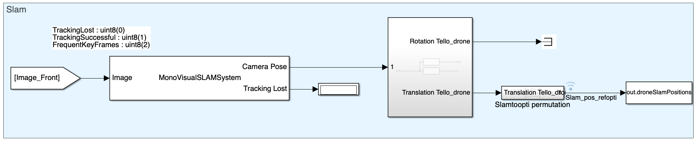
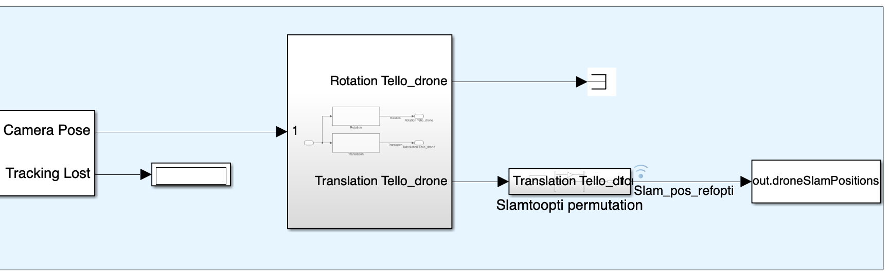
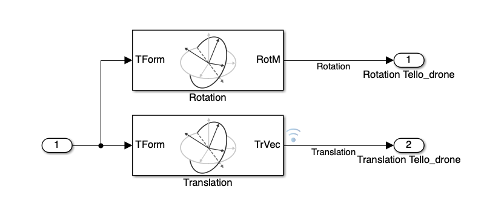
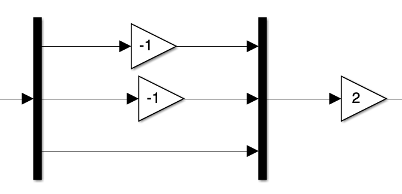

# SLAM (Simultaneous Localization and Mapping) on Simulink with Tello

MonoVSLAM in MATLAB is a powerful tool for creating 3D maps and tracking camera position using video or image streams. Ideal for real-time applications like autonomous navigation and augmented reality, it leverages advanced computer vision algorithms and integrates seamlessly with MATLAB for efficient analysis and prototyping.

## Simulink Block



### Managing MonoVSLAM

1. **Process:**

    To develop it in real-time in Simulink, we are using a MATLAB system. You can find it at this path:

    ```matlab
    Simulink_Tello_drone-main/Matlab_System/MonoVisualSLAMSystem.m
    ```

    ```mermaid
    flowchart LR
        A[Sensors] --> B[ORB Based Keypoint Detection and Matching]
        B --> C[Pose Estimation: Fundamental Matrix Triangulation Bundle Adjustment]
        C --> D[Path Estimation]
        D --> E[Loop Closure + Visual Odometry]
        C --> F[Camera Position + Local Map]
    ```

2. **Input:**

    

    You need to enter the intrinsic parameters of the camera and the size of the image:

    $$
    K = 
    \begin{pmatrix}
    f_x & 0 & c_x\\
    0 & f_y & c_y\\
    0 & 0   & 1
    \end{pmatrix}
    $$
    
    Secondly, you have to enter the parameters of the SLAM system:

    - **`numPoints`**: Specifies the number of feature points used for tracking and mapping in the SLAM algorithm.

        **Impact of Adjustment:**

        - **Increase**: Improves map and localization accuracy by allowing better recognition of distinct features in the environment. However, it increases computational demands and memory usage.
        - **Decrease**: Reduces computational load and memory requirements, speeding up processing, which is beneficial for real-time systems with limited resources. However, it may reduce localization accuracy and map quality.

    - **`numSkipFrames`**: Determines the number of frames to skip between consecutive processing steps in the SLAM algorithm.

        **Impact of Adjustment:**

        - **Increase**: Reduces processing frequency, lightening the computational load, which is useful for scenarios with slow movements or limited resources. However, it may decrease localization and mapping accuracy.
        - **Decrease**: Improves localization accuracy and map quality by processing more data, which is beneficial for environments with fast movements or frequent changes. However, it increases computational load and can slow down the system.

3. **Output:**

    The SLAM block provides two outputs:

    

    - **CameraPose**: The position of the drone in the SLAM referential, represented as a Homogeneous Transformation (TForm) matrix [4x4].
    - **TrackingLost**: Indicates the state of the SLAM. Possible values:
        - `TrackingLost`: uint8(0)
        - `TrackingSuccessful`: uint8(1)
        - `FrequentKeyFrames`: uint8(2)

    **How to Obtain Translation and Rotation Matrices:**

    

    We use the block `Coordinate Transformation Conversion`.

    **Transforming from SLAM Referential to Optitrack Referential:**

    

    We use `mux` and `demux` to permute the axes and also a gain to account for the scale factor between the SLAM position and the true position.

    The SLAM position in the referential is sent to the workspace using a `To Workspace` block and used by the semantic map to map it. For more details, see the [Object Detection documentation](ObjectDetection.md).
