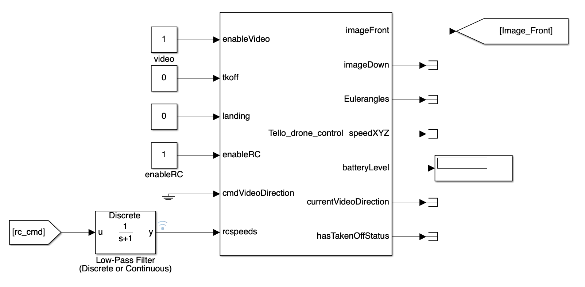
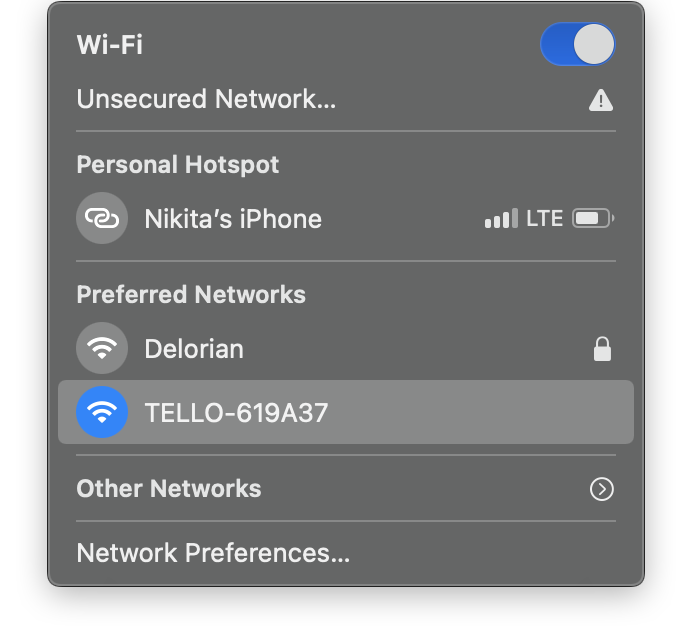
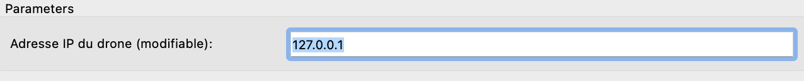
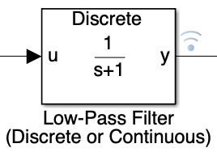

# Tello Drone Control

This document describes the Simulink block for controlling the Tello drone.

## Overview

This Simulink block manages various control aspects of the Tello drone, including video feed, takeoff, landing, and remote control (RC) commands. The block also outputs important telemetry data such as battery level, Euler angles, and speed.

### Simulink Block Diagram

1. **Overview of the Process and Goals:**

    The system provides control commands to the Tello drone and processes telemetry data. The goal is to enable real-time control and monitoring of the drone using Simulink.

    **Steps to connect the drone :** 

    - Connect the computer to the Tello drone Wifi

    

    - Enter the IP of the drone or `127.0.0.1` 

    

    - Run the Simulink 
    
    The first step is to enter the IP adress of the drone our this one to connect automaticaly to the drone connected to the wifi 

2. **Detailed View of the Simulink Block for Tello Drone Control:**

    **Inputs:**

    - **video**: Enables the video feed from the drone's cameras. Set to `1` to enable.
    - **tkoff**: Controls the takeoff command. Set to `1` to initiate takeoff.
    - **landing**: Controls the landing command. Set to `1` to initiate landing.
    - **enableRC**: Enables remote control commands. Set to `1` to enable.
    - **cmdVideoDirection**: Specifies the direction of the video feed (e.g., front or down).
    - **rcspeeds**: Contains the RC command inputs for controlling the drone's speed in various directions.
    
    **Outputs:**

    - **imageFront**: Provides the video feed from the front camera.
    - **imageDown**: Provides the video feed from the downward-facing camera.
    - **Eulerangles**: Outputs the Euler angles representing the drone's orientation.
    - **speedXYZ**: Outputs the drone's speed in the X, Y, and Z directions.
    - **batteryLevel**: Indicates the current battery level of the drone.
    - **currentVideoDirection**: Shows the current direction of the video feed.
    - **hasTakenOffStatus**: Indicates the takeoff status of the drone.

3. **Low-Pass Filter for RC Commands:**

    

    The low-pass filter processes the RC command inputs to smooth out the control signals. This helps in reducing noise and ensuring stable control.

## Conclusion

The Tello drone control Simulink block provides a comprehensive solution for controlling and monitoring the Tello drone. With real-time processing capabilities and seamless integration, it is ideal for various applications, including autonomous navigation and aerial monitoring.
