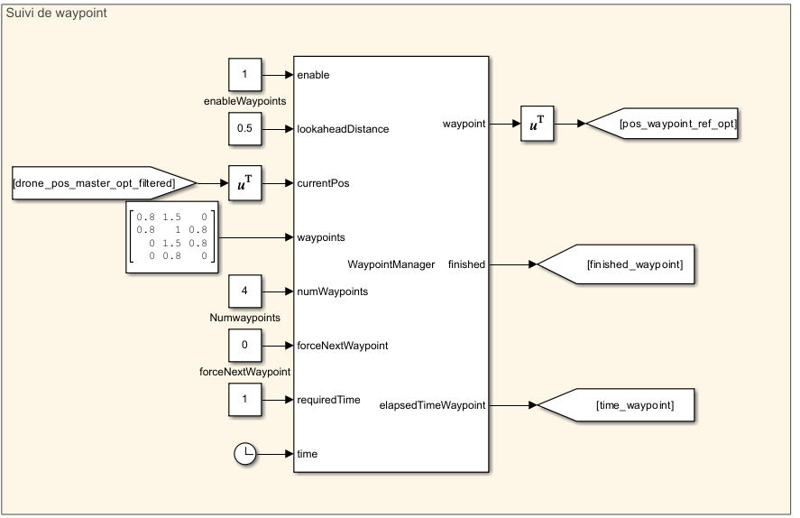
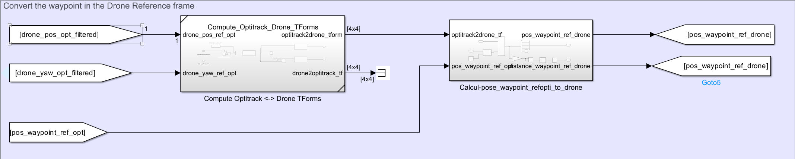

# Waypoints system

## Overview

In order to repeat the same scenario for evaluation purpose, we designed a basic waypoint system.

## Basic Drone Waypoint block

**Projet files**
- `Matlab_System\WaypointManager.m` : Contains the logic to loop through the waypoints
- `Simulink_Part\WaypointFollower.slx` : Simulink control panel in order to make a drone follow waypoints

### Process

The WaypointManager system manages the navigation of a drone through a series of waypoints. It tracks the drone's current position, determines the appropriate waypoint to navigate towards, and handles transitions between waypoints based on proximity and time spent at each waypoint.

Additionally, it includes functionality to force transitions and signals when all waypoints have been completed.

⚠️ This system is very basic and needs to be improved. For example, using a cubic or quintic regression would allow us to add speed and acceleration condition at each waypoint. Moreover, the yaw angle is not taken into account **yet**.

### Inputs

- `enable`: Enables the WaypointManager system to start processing.
- `acceptableDistance`: The acceptable distance to the current waypoint for the drone to be considered "at" the waypoint.
- `currentPos`: The current position of the drone, represented as a 3D coordinate.
- `waypoints`: A list of waypoints for the drone to follow, each waypoint represented as a 3D coordinate. Each waypoint is represented as a line $(x, y, z)$. Therefore, the matrix of $N$ waypoints has a size of $N\times3$.
- `numWaypoints`: The total number of waypoints in the list.
- `forceNextWaypoint`: A flag to manually force the transition to the next waypoint.
- `requiredTime`: The minimum time required to be spent at each waypoint before moving to the next.
- `time`: The current time, used to compute elapsed time and manage timing-related logic.

### Outputs

- **waypoint**: The current waypoint coordinates the drone is navigating towards.
- **finished**: A flag indicating whether the drone has finished navigating through all the waypoints (1 for finished, 0 for not finished).
- **elapsedTimeWaypoint**: The time spent at the current waypoint.

## Making the drone follow the waypoint

The waypoint manager block is responsible to select the waypoint to follow. It outputs a waypoint in the Optitrack reference.

In order to send the drone the correct commands, the waypoint is transformed from the Optitrack referential to the drone referential, using a dynamic transformation matrix computed in real time.

$$W_{drone} = T_{opt2drone}(t) \times W_{opt}$$

With :
- $T_{opt2drone}(t)$ the transformation matrix at a given moment $t$, computed by the `Compute_Optitrack_Drone_TForms.slx` Simulink part
- $W_{opt}$ a column vector containing $x, y$ and $z$, the coordinates of the waypoint in the **Optitrack** referential
- $W_{drone}$ a column vector containing $x, y$ and $z$, the  coordinates of the waypoint in the **Drone** referential

This transformation allows us to directly compute the position along the $x, y$ and $z$ coordinates (and therefore the error on each axis). These errors are then sent to the PID controller to follow the waypoint.

